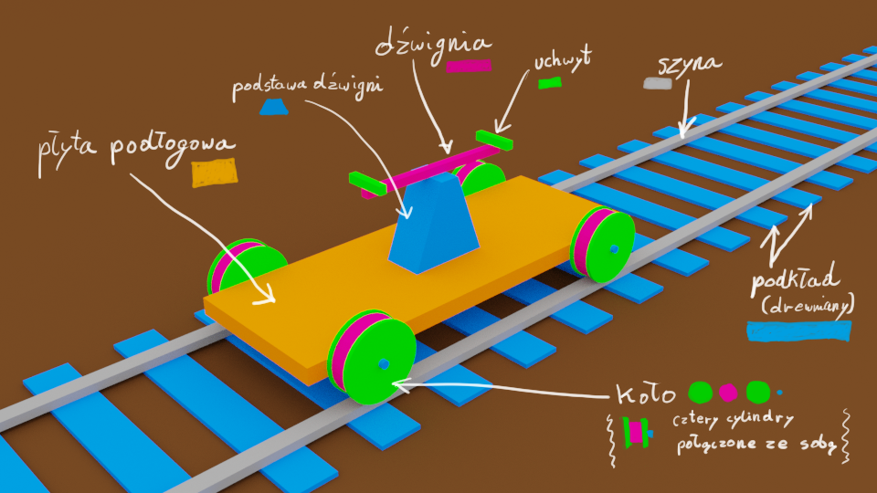

# Zespół
- Gerard Wypych
- Kamil Buczko
- Marcin Janczurewicz

# Opis
 Projekt polega na zamodelowaniu sceny, na której podstawowym elementem jest
 drezyna, tory, otoczenie wokół (kwiatki, drzewa, trawa).

# Szkic

# Opis elementów ruchomych

### Wszystkie elementy 
* Ruch w przód równolegle do szyn.

### Koła 
* Obrót wokół osi przechodzącej prostopadle przez ich środki.
* Pełen obrót koła będzie miał taki sam okres, jak przebycie przez drezyne odległości 2piR(R-promień koła).

### Dżwignia + Uchwyty
* Środek dźwigni pozostaje niewrażliwy na ruch pionowy.
* Uchwyty poruszają się przeciwlegle tzn. gdy jeden uchwyt obniży się w pionie o wartość x, to drugi w tym czasie podwyższy się o wartość x.

# Lista zadań

1. Przygotować listę zadań
2. Szkic drezyny oraz otoczenia
	- Narysować jak ma wyglądać drezyna i otoczenie
	- Wyróżnić poszczególne elementy drezyny i otoczenia
	- Opisać elementy ruchome
4. Przygotować szkielet programu
	- Struktura programu
	- Proste shadery
	- Obsługa kamery
8. Proceduralnie generowane modele elementów drezyny
9. Ustawienie elementów na scenie
10. Animacja
11. Proste oświetlenie
12. Tekstury
13. Prezentacja gotowego projektu