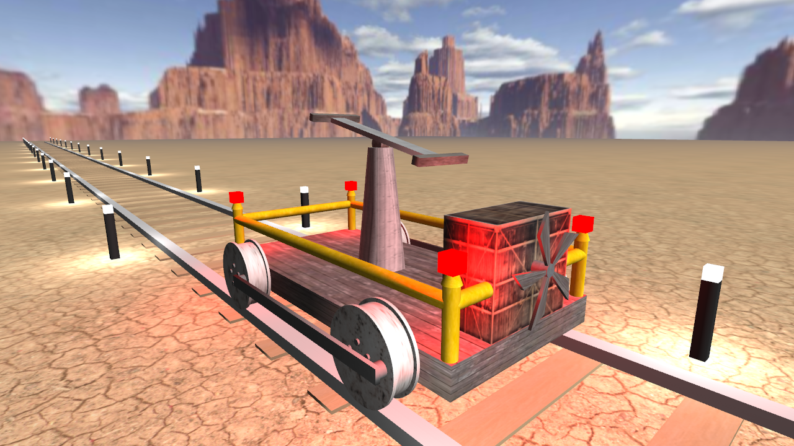

# Zespół
- Kamil Buczko
- Marcin Janczurewicz
- Gerard Wypych

# Podział pracy
- **Kamil Buczko** - stworzenie i ustawienie elementów na scenie, animacja, teksturowanie, proceduralne generowanie graniastosłupów foremnych wraz z normalnymi i mapowaniem UV
- **Marcin Janczurewicz** - stworzenie i ustawienie elementów na scenie, animacja, teksturowanie, modyfikacja generowania brył
- **Gerard Wypych** - szkielet programu (podstawowe klasy i metody, podział na scene, node, mesh itd.), kamera, sterowanie, oświetlenie, shadery, wczytywanie tekstur, skybox itp.

# Lista zadań

1. Przygotować listę zadań
2. Szkic drezyny oraz otoczenia
	- Narysować jak ma wyglądać drezyna i otoczenie
	- Wyróżnić poszczególne elementy drezyny i otoczenia
	- Opisać elementy ruchome
4. Przygotować szkielet programu
	- Struktura programu
	- Proste shadery
	- Obsługa kamery
5. Proceduralnie generowane modele elementów drezyny
6. Ustawienie elementów na scenie
7. Animacja
8. Proste oświetlenie
9. Tekstury
10. Prezentacja gotowego projektu

# Opis
Projekt polega na zamodelowaniu i wyświetleniu trójwymiarowej sceny składającej się z drezyny, torów i otoczenia.  
Na otoczenie składa się pustynny krajobraz, lampki przy torach oraz niebo (skybox) ze słońcem.

## Szkic

## Aktualny Stan

## Opis elementów ruchomych

### Wszystkie elementy 
* Ruch w przód równolegle do szyn.

### Koła 
* Obrót wokół osi przechodzącej prostopadle przez ich środki.
* Pełen obrót koła będzie miał taki sam okres, jak przebycie przez drezyne odległości 2piR(R-promień koła).

### Dżwignia + Uchwyty
* Środek dźwigni pozostaje niewrażliwy na ruch pionowy.
* Uchwyty poruszają się przeciwlegle tzn. gdy jeden uchwyt obniży się w pionie o wartość x, to drugi w tym czasie podwyższy się o wartość x.

# Mapa kodu

# Literatura oraz materiały źródłowe
- Materiały dostępne w ramach wykładu i laboratorium z przedmiotu Grafika Komputerowa
- https://learnopengl.com/ by Joey de Vries
- OpenGl Superbible: Comprehensive Tutorial and Reference (7th Edition) by Graham Sellers, Richard S. Wright Jr., Nicholas Haemel
- Tekstury: https://www.poliigon.com/ oraz https://pxhere.com/